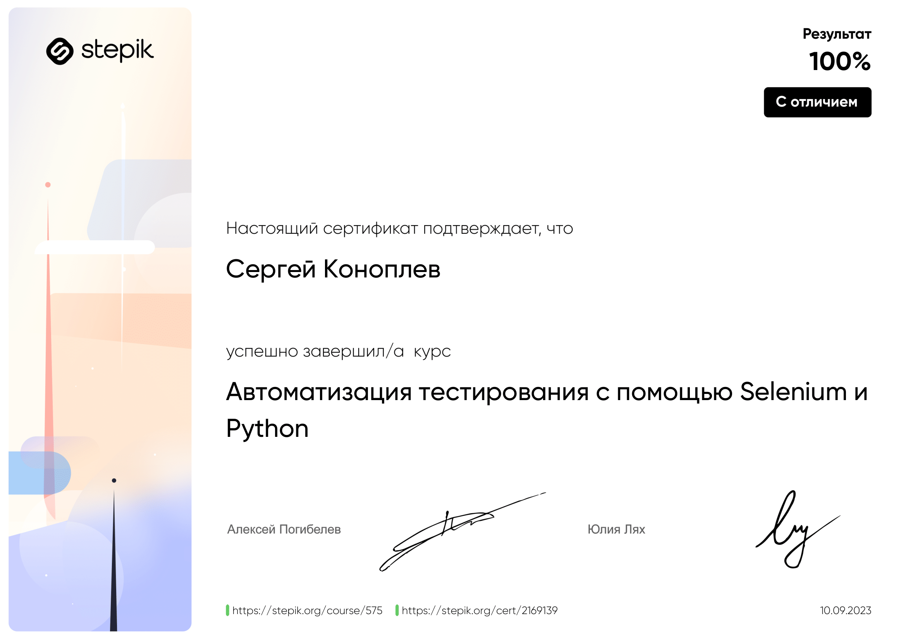
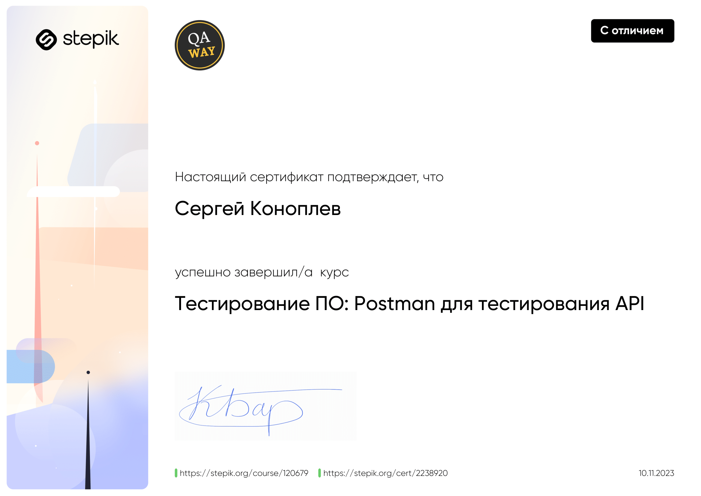

## Сертификаты об окончании курсов:

## Java - средний уровень. Платформа "Sololearn".

## SQL - средний уровень. Платформа "Sololearn".

## Мануальное тестирование, Артем Русов. Платформа "Stepik".

## Автоматизация на Python. Платформа "Stepik".

## Тестирование с помощью Postman. Платформа "Stepik".

## Наставник по мануальному тестированию. Платформа "Антитренинги".

## Подтверждение знания английского языка, уровень B1. Платформа "EF SET".
